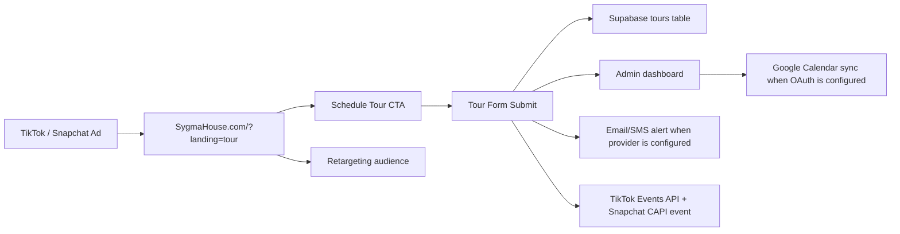

# Sygma House Commercial Production System

## Executive Summary

The first Sygma House campaign is a real-filmed 60-second cinematic healthcare commercial designed to drive tour scheduling from TikTok and Snapchat traffic. The creative must feel warm, local, premium, and human, with no AI-avatar, stock-footage, corporate healthcare, or overly dramatic tone.

Current production status: `PARTIALLY READY`.

The website now supports the required ad funnel architecture in code. Final launch depends on adding provider credentials in Vercel for TikTok Pixel, TikTok Events API, Snapchat Pixel, Snapchat CAPI, email/SMS alerts, and Google Calendar OAuth.

## Production Validation Gate

Best hook: doorway greeting.

Why it wins:

- Human contact appears immediately.
- The adult child has visible concern and hope.
- The caregiver greeting creates trust without explaining it.
- The scene has motion in the first two seconds.
- It avoids logo-first or generic exterior openings.

Validation scores:

| Layer | Score |
| --- | ---: |
| Thumb-stop | 8.5/10 |
| Emotional realism | 9/10 |
| Trust | 8.5/10 |
| Dignity and independence | 9/10 |
| Cultural realism | 8.5/10 |
| Local authenticity | 8/10 |
| Cinematic readiness | 8.5/10 |
| Lead conversion readiness | 6/10 |
| Overall production readiness | 7.8/10 |

## Campaign Architecture

## Tracking Events

| Event | Trigger |
| --- | --- |
| `ViewContent` | Site load and ad tour landing view |
| `ScheduleTourStart` | User opens the tour form/page |
| `ScheduleTourSubmit` | Tour request is accepted by the backend |
| `IntakeStart` | User opens the intake form |
| `IntakeSubmit` | Intake form is accepted by the backend |

## Platform Event Mapping

| Sygma event | TikTok browser/API event | Snapchat browser/API event |
| --- | --- | --- |
| `ViewContent` | `ViewContent` | `VIEW_CONTENT` |
| `ScheduleTourStart` | `ClickButton` | `CUSTOM_EVENT_1` |
| `ScheduleTourSubmit` | `SubmitForm` | `SIGN_UP` |
| `IntakeStart` | `ClickButton` | `CUSTOM_EVENT_2` |
| `IntakeSubmit` | `SubmitForm` | `SIGN_UP` |

## Storyboard

| Time | Scene | Direction |
| --- | --- | --- |
| 0-8s | Door opens to caregiver greeting | Warm daylight, handheld or slow gimbal, real smile, no logo opening |
| 8-22s | Adult child enters with concern | Subtle facial tension, natural pause, soft room tone |
| 22-30s | Resident chooses seat by window | Show autonomy, comfort, and independence |
| 30-36s | Caregiver offers tea or water | Supportive, not controlling |
| 36-42s | Medication organization insert | Clean, brief, professional trust signal |
| 42-48s | Meal prep and dining conversation | Human warmth, calm home rhythm |
| 48-55s | Family member sees resident relaxed | Relief, not exaggerated emotion |
| 55-60s | Exterior home and CTA | Logo, website, Schedule a Tour |

## Voiceover

Female narrator:

> Finding care for someone you love is personal.

Male narrator:

> At Sygma House, support feels less like an institution and more like home.

Female narrator:

> A small assisted living home in Minnesota, with daily support, dignity, and real connection.

Male narrator:

> Visit SygmaHouse.com to schedule a tour.

## Shot List

- Doorway greeting between caregiver and family member.
- Adult child entering with concern and hope.
- Resident choosing a preferred seat.
- Caregiver offering tea or water.
- Medication organization shown cleanly and briefly.
- Dining table meal prep and conversation.
- Resident walking with support nearby, not being controlled.
- Family member smiling with relief.
- Exterior home shot at golden hour.
- End card with website and tour CTA.

## Platform Variants

| Platform | Format | Notes |
| --- | --- | --- |
| Instagram Reels | 30s vertical | Faster doorway hook, captions on |
| TikTok | 20-30s vertical | Less polished, more natural, no corporate feel |
| Snapchat | 15-25s vertical | Fastest hook, mobile-first CTA, simple captions |
| YouTube Shorts | 30s vertical | CTA visible by final 5 seconds |
| Retargeting | 15s | "Still exploring care options? Schedule a tour." |

## Lead Funnel Checklist

- TikTok Pixel installs through `TIKTOK_PIXEL_ID`.
- TikTok Events API sends through `TIKTOK_ACCESS_TOKEN`.
- Snapchat Pixel installs through `SNAPCHAT_PIXEL_ID`.
- Snapchat CAPI sends through `SNAPCHAT_ACCESS_TOKEN`.
- Tour request writes to Supabase.
- Intake request writes to Supabase.
- UTM attribution persists on leads, tours, messages, and traffic events.
- Admin dashboard receives live records.
- Email alert sends when `RESEND_API_KEY` and `ADMIN_EMAIL` are configured.
- SMS alert sends when Twilio and `ADMIN_PHONE` are configured.
- Google Calendar sync sends when Google OAuth refresh token is configured.

## Launch Risks

- TikTok Pixel/Events API cannot send until production env vars are set.
- Snapchat Pixel/CAPI cannot send until production env vars are set.
- Google Calendar sync cannot create events until OAuth refresh token is created.
- SMS cannot send until Twilio credentials and admin phone are set.
- Real filming requires signed releases for residents, family actors, and staff.
- Any waiver-funded eligibility copy must remain careful and non-promissory.

## Final Video Build Package

Master deliverables:

- `60s master`: cinematic documentary, 16:9, center-safe for 9:16.
- `30s TikTok/Snap cut`: starts with the doorway greeting and reaches CTA by second 24.
- `15s retargeting cut`: starts with resident comfort/payoff, then "Still exploring care options?"
- `Caption file`: burned-in vertical-safe captions plus editable SRT.
- `End card`: Sygma House logo, `SygmaHouse.com`, "Schedule a Tour."

Production note:

This package is ready for real filming or for a dedicated video-generation pipeline. It intentionally does not rely on fake AI residents, synthetic healthcare scenes, or stock-footage energy.
